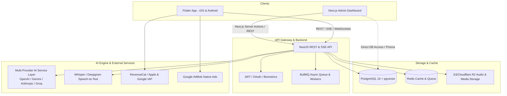

# Mindora ("Your AI Second Brain") — Master Technical Implementation Plan

## Executive Overview
**Mindora** is a premier, intelligent "AI Second Brain" cross-platform application for iOS and Android, backed by an intelligent NestJS/PostgreSQL backend with vector embeddings, and managed via a dedicated Next.js Admin Portal.
Tagline: **"Capture. Understand. Organize. Remember."**
Core Promise: **"Mindora helps you capture anything and our AI turns it into organized notes, tasks, lists and insights you can actually use."**

Instead of functioning as a passive notebook or a generic ChatGPT wrapper, Mindora continuously analyzes, organizes, indexes, links, and synthesizes unstructured thought into structured tasks, reminders, smart lists, knowledge graphs, and daily briefings.

---

## Brand Design Tokens & UI Aesthetics (From Approved Visual Reference)

### Color Palette & Visual Identity
* **Primary Brand Colors**:
  * **Brand Indigo / Violet**: `#6366F1` (Accents, FAB, Pro gradient start `#7C3AED`)
  * **AI Emerald / Mint**: `#10B981` / `#A7F3D0` (Daily briefing card, completed tasks, waveform peaks)
  * **Pro Radiant Gradient**: `#8B5CF6` to `#EC4899` (Paywall button, `✦ PRO` badge)
  * **Backgrounds**:
    * Clean Modern Light Canvas: `#F8FAFC` to `#FFFFFF` with ultra-soft gray container borders (`#F1F5F9`)
    * Obsidian Dark Mode (Meeting Mode & Dark Theme): `#0E1117` with elevated panels (`#161B22`) and slate borders (`#282E3A`)
* **Quick Capture Pill Colors**:
  * ✏️ **Write**: Mint `#E8F9EE` / Text `#16A34A`
  * 🎙️ **Voice**: Lavender `#F3EEFD` / Text `#7C3AED`
  * 🔲 **Scan**: Soft Amber `#FEF9C3` / Text `#D97706`
  * 📷 **Photo**: Soft Sky `#E0F2FE` / Text `#0284C7`
  * 📋 **List**: Soft Rose `#FCE7F3` / Text `#DB2777`
* **Typography**: `Plus Jakarta Sans` with `Inter` fallbacks.
* **Component Specs**:
  * **Home Screen**: Floating search bar with sparkle AI icon, Today metric pill grid (Tasks, Events, Reminders), Mint Daily Briefing card with `[View Briefing]` CTA, Project progress cards with percentage bar, and Recent Notes list with chevron navigation.
  * **Capture Selector**: 5-pill horizontal scrollable quick capture bar.
  * **In-Editor Context Extractor**: "AI turns messy thoughts into clear action" — split card view with extracted People, Projects, Tasks, and Deadlines.
  * **Ask Your Notes**: Chat UI with cited source pills (`[Meeting with John - Today, 10:30 AM]`) linking directly to notes.
  * **Meeting Mode (✦ PRO)**: High-contrast dark studio view with active sine-wave audio frequency visualizer, live digital timer (`45:12`), red stop trigger, and automated outcome guarantees (Transcript, Summary, Decisions, Action Items, Deadlines).
  * **Paywall Screen**: Two-tier side-by-side comparison (Free $0 vs Pro $4.99) with "Most Popular" glow pill and benefit checklist.

---

## 1. System Architecture & Tech Stack



### 1.1 Technology Stack Selection
* **Mobile Client**:
  * **Framework**: Flutter 3.x (Dart 3.x)
  * **State Management**: `flutter_riverpod` (v2.x with code generation)
  * **Navigation**: `go_router` (declarative routing with deep linking)
  * **Networking**: `dio` with interceptors (auth refresh, retry, logging)
  * **Local Storage & Cache**: `drift` (SQLite) or `hive_flutter` for offline-first resilience
  * **Audio Recording & Playback**: `record` (m4a/aac/wav) and `audioplayers`
  * **Graph Visualization**: `flutter_force_directed_graph` / Custom Canvas painter
  * **Styling & Theme**: Material 3 with bespoke Dark/Light theme, glassmorphism, Google Fonts (`Plus Jakarta Sans`), and `flutter_animate`
  * **Monetization & Ads**: `purchases_flutter` (RevenueCat) and `google_mobile_ads`
* **Backend API**:
  * **Framework**: NestJS (TypeScript, Node.js 20+ LTS)
  * **Database ORM**: Prisma ORM with PostgreSQL 16
  * **Vector Database**: `pgvector` extension for semantic vector similarity search
  * **Caching & Queues**: Redis with `bullmq` for background job execution (audio transcription, meeting distillation, cron daily briefings)
  * **File Storage**: AWS S3 / Cloudflare R2 presigned URLs for voice memos and attachments
  * **API Documentation**: OpenAPI / Swagger (`@nestjs/swagger`)
* **Admin Dashboard**:
  * **Framework**: Next.js 14+ (App Router, React Server Components, TypeScript)
  * **UI & Styling**: Tailwind CSS, `shadcn/ui`, Lucide Icons, Recharts for visual analytics
  * **Data Fetching**: TanStack Query (React Query)
* **AI Service Layer**:
  * **Architecture**: Provider-independent adapter pattern (`AiProviderService`) supporting OpenAI, Anthropic Claude, Google Gemini, and Groq
  * **Embeddings**: `text-embedding-3-small` / `text-embedding-3-large`
  * **Voice STT**: OpenAI Whisper API / Deepgram Nova-2
  * **Validation**: `zod` for strict structured JSON output parsing

---

## 2. Monorepo / Repository Directory Layout

```
app-square/
├── apps/
│   ├── mobile/                  # Flutter Mobile Application
│   │   ├── android/
│   │   ├── ios/
│   │   ├── lib/
│   │   │   ├── core/            # Theme, constants, networking, routing, storage
│   │   │   ├── features/        # Feature-driven modular architecture
│   │   │   │   ├── auth/
│   │   │   │   ├── notes/
│   │   │   │   ├── tasks/
│   │   │   │   ├── ai_assistant/
│   │   │   │   ├── voice/
│   │   │   │   ├── meeting/
│   │   │   │   ├── projects/
│   │   │   │   ├── graph/
│   │   │   │   ├── briefing/
│   │   │   │   ├── paywall/
│   │   │   │   └── settings/
│   │   │   └── main.dart
│   │   └── pubspec.yaml
│   │
│   ├── backend/                 # NestJS Core API & AI Service
│   │   ├── src/
│   │   │   ├── common/          # Guards, decorators, filters, interceptors
│   │   │   ├── config/          # Environment configuration
│   │   │   ├── database/        # Prisma service & pgvector extensions
│   │   │   ├── modules/
│   │   │   │   ├── auth/
│   │   │   │   ├── users/
│   │   │   │   ├── notes/
│   │   │   │   ├── tasks/
│   │   │   │   ├── projects/
│   │   │   │   ├── ai/          # Multi-provider LLM engine & prompt templates
│   │   │   │   ├── vector/      # Embeddings & similarity search
│   │   │   │   ├── audio/       # Whisper transcription & audio storage
│   │   │   │   ├── meetings/
│   │   │   │   ├── graph/       # Knowledge connection generator
│   │   │   │   ├── briefings/   # Cron-based daily briefing service
│   │   │   │   ├── billing/     # RevenueCat webhooks & plan limits
│   │   │   │   └── admin/       # Endpoints tailored for Next.js Admin
│   │   │   └── main.ts
│   │   ├── prisma/
│   │   │   ├── schema.prisma
│   │   │   └── migrations/
│   │   ├── package.json
│   │   └── Dockerfile
│   │
│   └── admin/                   # Next.js Web Admin Portal
│       ├── src/
│       │   ├── app/             # App Router pages (auth, users, ai-config, analytics)
│       │   ├── components/      # UI components (data tables, charts, modals)
│       │   ├── lib/             # API clients, auth helpers, types
│       │   └── styles/
│       ├── package.json
│       └── Dockerfile
│
├── docker-compose.yml           # Local dev: Postgres with pgvector, Redis, MinIO
└── implementation.md            # Master Blueprint & Roadmap (This Document)
```

---

## 3. Database Schema Design (PostgreSQL + pgvector)

```prisma
datasource db {
  provider   = "postgresql"
  url        = env("DATABASE_URL")
  extensions = [pgvector(map: "vector")]
}

generator client {
  provider        = "prisma-client-js"
  previewFeatures = ["postgresqlExtensions"]
}

enum Role {
  USER
  ADMIN
  SUPERADMIN
}

enum SubscriptionTier {
  FREE
  PRO
}

enum TaskPriority {
  LOW
  MEDIUM
  HIGH
  URGENT
}

enum TaskStatus {
  PENDING
  IN_PROGRESS
  COMPLETED
  CANCELLED
}

enum MeetingStatus {
  RECORDING
  PROCESSING
  COMPLETED
  FAILED
}

model User {
  id               String           @id @default(uuid())
  email            String           @unique
  passwordHash     String?
  fullName         String?
  avatarUrl        String?
  role             Role             @default(USER)
  subscriptionTier SubscriptionTier @default(FREE)
  revenueCatAppUserId String?       @unique
  stripeCustomerId String?
  subscriptionExpiresAt DateTime?

  // AI Token and Usage Tracking
  monthlyAiTokensUsed Int           @default(0)
  aiQuotaResetAt   DateTime         @default(now())

  createdAt        DateTime         @default(now())
  updatedAt        DateTime         @updatedAt

  notes            Note[]
  tasks            Task[]
  projects         Project[]
  meetings         Meeting[]
  lists            SmartList[]
  reminders        Reminder[]
  dailyBriefings   DailyBriefing[]
  aiConversations  AiConversation[]
  nodeConnections  KnowledgeConnection[]

  @@index([email])
  @@index([subscriptionTier])
}

model Project {
  id          String    @id @default(uuid())
  userId      String
  name        String
  description String?
  colorHex    String?   @default("#6366F1")
  icon        String?   @default("folder")
  aiSummary   String?   @db.Text
  createdAt   DateTime  @default(now())
  updatedAt   DateTime  @updatedAt

  user        User      @relation(fields: [userId], references: [id], onDelete: Cascade)
  notes       Note[]
  tasks       Task[]

  @@index([userId])
}

model Note {
  id             String    @id @default(uuid())
  userId         String
  projectId      String?
  title          String    @default("Untitled Note")
  content        String    @db.Text
  summary        String?   @db.Text
  isPinned       Boolean   @default(false)
  isArchived     Boolean   @default(false)
  extractedEntities Json?  // { people: [], dates: [], topics: [], companies: [] }
  
  // 1536-dimension embedding for OpenAI text-embedding-3-small
  embedding      Unsupported("vector(1536)")?

  createdAt      DateTime  @default(now())
  updatedAt      DateTime  @updatedAt

  user           User      @relation(fields: [userId], references: [id], onDelete: Cascade)
  project        Project?  @relation(fields: [projectId], references: [id], onDelete: SetNull)
  tasks          Task[]
  lists          SmartList[]
  reminders      Reminder[]
  connectionsFrom KnowledgeConnection[] @relation("ConnectionFrom")
  connectionsTo   KnowledgeConnection[] @relation("ConnectionTo")

  @@index([userId])
  @@index([projectId])
  @@index([createdAt])
}

model KnowledgeConnection {
  id             String    @id @default(uuid())
  userId         String
  fromNoteId     String
  toNoteId       String
  relationType   String    // e.g., "depends_on", "same_entity", "project_reference", "topic_similarity"
  strength       Float     @default(0.5) // 0.0 to 1.0 confidence/similarity score
  contextNote    String?

  createdAt      DateTime  @default(now())

  user           User      @relation(fields: [userId], references: [id], onDelete: Cascade)
  fromNote       Note      @relation("ConnectionFrom", fields: [fromNoteId], references: [id], onDelete: Cascade)
  toNote         Note      @relation("ConnectionTo", fields: [toNoteId], references: [id], onDelete: Cascade)

  @@unique([fromNoteId, toNoteId, relationType])
  @@index([userId])
}

model Task {
  id          String       @id @default(uuid())
  userId      String
  noteId      String?
  projectId   String?
  title       String
  description String?
  status      TaskStatus   @default(PENDING)
  priority    TaskPriority @default(MEDIUM)
  dueDate     DateTime?
  dueTimeStr  String?      // e.g. "Tomorrow afternoon" or parsed format
  isAiExtracted Boolean    @default(false)

  createdAt   DateTime     @default(now())
  updatedAt   DateTime     @updatedAt

  user        User         @relation(fields: [userId], references: [id], onDelete: Cascade)
  note        Note?        @relation(fields: [noteId], references: [id], onDelete: SetNull)
  project     Project?     @relation(fields: [projectId], references: [id], onDelete: SetNull)
  reminders   Reminder[]

  @@index([userId])
  @@index([status])
  @@index([dueDate])
}

model SmartList {
  id          String          @id @default(uuid())
  userId      String
  noteId      String?
  title       String
  isAiGenerated Boolean       @default(false)
  items       SmartListItem[]

  createdAt   DateTime        @default(now())
  updatedAt   DateTime        @updatedAt

  user        User            @relation(fields: [userId], references: [id], onDelete: Cascade)
  note        Note?           @relation(fields: [noteId], references: [id], onDelete: SetNull)

  @@index([userId])
}

model SmartListItem {
  id          String     @id @default(uuid())
  listId      String
  content     String
  isCompleted Boolean    @default(false)
  position    Int        @default(0)

  smartList   SmartList  @relation(fields: [listId], references: [id], onDelete: Cascade)

  @@index([listId])
}

model Meeting {
  id           String        @id @default(uuid())
  userId       String
  title        String        @default("Recorded Meeting")
  audioUrl     String?
  durationSec  Int           @default(0)
  status       MeetingStatus @default(RECORDING)
  transcript   String?       @db.Text
  summary      String?       @db.Text
  decisions    Json?         // Array of strings
  actionItems  Json?         // Array of { assignee: string, task: string, deadline: string }
  
  createdAt    DateTime      @default(now())
  updatedAt    DateTime      @updatedAt

  user         User          @relation(fields: [userId], references: [id], onDelete: Cascade)

  @@index([userId])
}

model Reminder {
  id          String    @id @default(uuid())
  userId      String
  noteId      String?
  taskId      String?
  title       String
  remindAt    DateTime
  isCompleted Boolean   @default(false)

  createdAt   DateTime  @default(now())

  user        User      @relation(fields: [userId], references: [id], onDelete: Cascade)
  note        Note?     @relation(fields: [noteId], references: [id], onDelete: SetNull)
  task        Task?     @relation(fields: [taskId], references: [id], onDelete: SetNull)

  @@index([userId])
  @@index([remindAt])
}

model DailyBriefing {
  id          String    @id @default(uuid())
  userId      String
  date        DateTime  @db.Date
  headline    String
  tasksJson   Json      // Top 3 priority items
  meetingsJson Json     // Upcoming events
  contextInsight String @db.Text
  deliveredAt DateTime?

  createdAt   DateTime  @default(now())

  user        User      @relation(fields: [userId], references: [id], onDelete: Cascade)

  @@unique([userId, date])
  @@index([userId])
}

model AiConversation {
  id          String        @id @default(uuid())
  userId      String
  title       String        @default("Second Brain Inquiry")
  messages    AiMessage[]

  createdAt   DateTime      @default(now())
  updatedAt   DateTime      @updatedAt

  user        User          @relation(fields: [userId], references: [id], onDelete: Cascade)

  @@index([userId])
}

model AiMessage {
  id             String         @id @default(uuid())
  conversationId String
  role           String         // "user" | "assistant" | "system"
  content        String         @db.Text
  citedNoteIds   Json?          // Array of note IDs referenced in the response
  createdAt      DateTime       @default(now())

  conversation   AiConversation @relation(fields: [conversationId], references: [id], onDelete: Cascade)

  @@index([conversationId])
}

model SystemSetting {
  id          String    @id @default(uuid())
  key         String    @unique
  value       Json
  description String?
  updatedAt   DateTime  @updatedAt
}
```

---

## 4. AI Engine Architecture & Provider Abstraction

### 4.1 Multi-Provider AI Abstraction
The system implements the Strategy Pattern to insulate the mobile client and core business logic from vendor lock-in.

```typescript
// backend/src/modules/ai/interfaces/ai-provider.interface.ts
export interface AiCompletionOptions {
  model?: string;
  temperature?: number;
  maxTokens?: number;
  responseFormat?: 'json_object' | 'text';
  systemPrompt: string;
  userPrompt: string;
}

export interface IAiProvider {
  generateText(options: AiCompletionOptions): Promise<string>;
  generateStructuredJson<T>(options: AiCompletionOptions, schema: any): Promise<T>;
  generateEmbedding(text: string): Promise<number[]>;
  transcribeAudio(fileBuffer: Buffer, mimeType: string): Promise<string>;
}
```

### 4.2 Structured Output Schemas (Zod)
Every AI operation executes with structured, schema-validated JSON outputs:
* **Context Extraction**:
  ```json
  {
    "people": ["John", "Sarah"],
    "projects": ["Delivery App"],
    "deadlines": ["Before September"],
    "tasks": [
      { "title": "Finish payment integration", "priority": "HIGH", "dueDate": "2026-08-31" },
      { "title": "Review logo draft", "priority": "MEDIUM", "dueDate": null }
    ],
    "relatedTopics": ["Website launch", "Webhook security"],
    "suggestedTitle": "Meeting with John: Launch Timelines"
  }
  ```
* **Meeting Distillation**:
  ```json
  {
    "summary": "Discussed Q3 launch roadmap and core payment gateway blockers.",
    "decisions": ["Deploy to production by August 28th", "Adopt Stripe over PayPal for v1"],
    "actionItems": [
      { "assignee": "Emmanuel", "task": "Resolve webhook signature verification", "deadline": "Tomorrow" },
      { "assignee": "Sarah", "task": "Finalize marketing landing copy", "deadline": "Friday" }
    ],
    "sentiment": "Positive and focused"
  }
  ```
* **Daily Briefing**:
  ```json
  {
    "greeting": "Good morning! Here is what matters today.",
    "topTasks": ["Finish payment integration", "Call John regarding API specs"],
    "upcomingMeetings": ["2:00 PM - Design Sync"],
    "contextualInsight": "Yesterday you noted that the website launch depends strictly on completing payment webhooks."
  }
  ```

### 4.3 Semantic Search & Hybrid Retrieval (RAG)
Vector similarity querying using SQL and pgvector:
```sql
SELECT id, title, content, summary, 
       1 - (embedding <=> $1::vector) AS similarity
FROM "Note"
WHERE "userId" = $2
  AND 1 - (embedding <=> $1::vector) > 0.65
ORDER BY similarity DESC
LIMIT 5;
```
For "Ask Your Notes", top matching notes are injected as context into the prompt with bracketed citations `[Note: <id>]`. The client parses these citations into clickable badges that open the source note.

---

## 5. Monetization, Quotas & Advertising Guardrails

### 5.1 Free vs. Pro Feature Gating

| Feature | Free Tier ($0/mo) | Pro Tier ($4.99/mo) |
| :--- | :--- | :--- |
| **Basic Notes & Search** | Unlimited | Unlimited |
| **AI Context & Summaries** | Standard Model, Basic Extraction | Advanced LLM (GPT-4o / Claude 3.5), Deep Extraction |
| **Monthly AI Quota** | Configurable token allowance (e.g. 50k tokens/mo) | Fair use high ceiling (e.g. 2M tokens/mo) |
| **Meeting Mode** | Locked behind Pro | Full background recording, transcription & action items |
| **Daily AI Briefing** | Locked behind Pro | Delivered every morning at 7:00 AM local time |
| **Knowledge Graph** | Locked behind Pro | Interactive node & connection exploration |
| **Ads** | Subtle native sponsored cards | **100% Ad-Free Experience** |

### 5.2 Advertising Philosophy & Strict Code Guardrails
Ads are monetized using Google AdMob native advanced banners. To preserve the sacred nature of note-taking, the following hard constraints are enforced:
1. **Never on App Launch**: No app-open ads.
2. **Never in Editor / While Typing**: The note editing screen is strictly ad-free.
3. **Never During Audio Recording / Meetings**: The recording microphone lock acquires an app-wide ad suppression lock.
4. **Sparse Home Feed Card**: At most 1 native styled card between "Continue where you left off" and "Recent Notes".
5. **Soft Upgrades on Limit Exceeded**: When a Free user exhausts their AI allowance, an elegant upgrade bottom sheet is presented with one-tap Pro subscription options.

---

## 6. Powerful Next.js Admin Panel Specifications

The Admin Web Dashboard gives operators complete visibility and granular control:
1. **Dashboard Overview**:
   * Real-time metrics: Daily Active Users (DAU), Monthly Active Users (MAU), Free vs Pro conversion rate, Monthly Recurring Revenue (MRR).
   * AI Consumption Telemetry: Total tokens consumed, cost breakdown by provider (OpenAI vs Anthropic vs Gemini), average latency per request.
2. **User Management**:
   * Search users by email, user ID, or subscription tier.
   * View user note counts, storage used, and AI quota consumption.
   * Actions: Override subscription tier (grant complimentary Pro), reset monthly AI quota, ban or delete account.
3. **AI Provider & Model Controller**:
   * Hot-swap active LLM providers without redeploying code.
   * Configure model names (e.g., `gpt-4o-mini` for Free, `gpt-4o` / `claude-3-5-sonnet` for Pro).
   * Edit system prompt templates for note extraction, meeting summaries, and daily briefings.
4. **Ad Placement & Monetization Controls**:
   * Toggle global ad network enabled/disabled.
   * Tune ad frequency intervals (e.g. display native card once every N note opens).
5. **System Health & Logs**:
   * BullMQ queue status (active audio transcriptions, failed briefing jobs).
   * Sentry / Datadog error tracking stream.

---

## 7. Mobile UI/UX Design System (Flutter)

### 7.1 Design Tokens & Aesthetic
* **Theme**: Deep obsidian dark mode (`#0B0D13`) with subtle card elevated backgrounds (`#161A23`), slate borders (`#262B36`), and vibrant accents:
  * Primary Accent: Neon Violet / Indigo (`#6366F1`)
  * AI Shimmer / Pro Accent: Radiant Amber / Gold (`#F59E0B` to `#EC4899` gradient)
  * Success / Completed: Emerald (`#10B981`)
  * High Priority / Urgency: Rose Crimson (`#F43F5E`)
* **Typography**: `Plus Jakarta Sans` or `Outfit` via Google Fonts. Clear tabular figures for counters and timers.
* **Micro-interactions**:
  * Gentle haptic feedback on task completion, recording toggle, and AI generation completion.
  * Skeleton loading states with subtle shimmer waves.
  * Hero transitions from note card to full-screen editor.
* **Navigation Architecture**:
  * 5 Bottom Tabs: **Home**, **Notes**, **Tasks**, **AI Assistant**, **Profile**.
  * Floating Central Capture Action Button (FAB): Expands with radial micro-animation into **Quick Note**, **Voice**, **Task**, **Smart List**, **Meeting Mode**.

---

## 8. Detailed 13-Phase Step-by-Step Implementation Roadmap

### Phase 1: Foundation, Infrastructure & Monorepo Setup
* **Goal**: Establish the repository, developer tools, database, and base container infrastructure.
* **Tasks**:
  1. Initialize monorepo directory layout (`apps/mobile`, `apps/backend`, `apps/admin`).
  2. Setup `docker-compose.yml` with PostgreSQL 16 (with `pgvector`), Redis 7, and LocalStack/MinIO for S3 emulation.
  3. Initialize NestJS backend with Prisma ORM, configure database migrations, and enable vector extension.
  4. Initialize Flutter mobile project with `flutter_riverpod`, `go_router`, `dio`, and theme foundation.
  5. Initialize Next.js 14 project with Tailwind CSS and `shadcn/ui`.

### Phase 2: Authentication, User Profiles & Security
* **Goal**: Secure multi-platform authentication with refresh token rotation and biometrics.
* **Tasks**:
  1. Backend: Implement JWT authentication with access + refresh token flow, password hashing (bcrypt), and OAuth (Google & Apple Sign-In).
  2. Mobile: Build modern onboarding carousel, login/signup forms, token storage in `flutter_secure_storage`, and biometric unlock (`local_auth`).
  3. Admin: Build administrative login with Role-Based Access Control (RBAC: `ADMIN`, `SUPERADMIN`).

### Phase 3: Core Notes Module & High-Performance Editor
* **Goal**: Fast, offline-resilient note taking and rendering.
* **Tasks**:
  1. Backend: Create CRUD endpoints for notes with pagination, tag filtering, and pinning.
  2. Mobile: Build responsive note grid/list with staggered animation, debounce auto-save, Markdown preview, and offline caching with Drift/Hive.
  3. Search: Implement fast keyword filtering on the client and PostgreSQL full-text search index.

### Phase 4: AI Engine & Provider-Agnostic Extraction Layer
* **Goal**: AI layer that automatically extracts people, projects, deadlines, and actionable tasks from raw text.
* **Tasks**:
  1. Backend: Build `AiModule` with pluggable adapters (OpenAI, Gemini, Anthropic, Groq).
  2. Implement `extractContextFromNote(content)` with strict Zod JSON schema validation.
  3. Embeddings: Automatically generate and store 1536-dim vector embeddings upon note creation/update.
  4. Mobile: In-editor "✨ AI Extract" bottom sheet displaying detected entities with one-tap confirmation chips.

### Phase 5: Tasks, Reminders & AI Smart Lists
* **Goal**: Seamless translation of thoughts into actionable, scheduled commitments.
* **Tasks**:
  1. Backend: Task CRUD, status updates, priority sorting, and auto-linking to Notes and Projects.
  2. Mobile: Unified Tasks screen with "Today", "Upcoming", and "Completed" tabs.
  3. Smart Lists: Natural language list creation (e.g. "Office shopping list"), item check-off animations, and reordering.
  4. Local Notifications: Configure `flutter_local_notifications` to schedule alarms for reminder dates.

### Phase 6: Semantic Search & "Ask Your Notes" RAG Assistant
* **Goal**: Intelligent retrieval and conversational interaction over the user's entire knowledge base.
* **Tasks**:
  1. Backend: Implement pgvector cosine similarity endpoint (`/ai/search?query=...`).
  2. Backend: Build `/ai/chat` endpoint with streaming Server-Sent Events (SSE) providing synthesized answers with cited note IDs.
  3. Mobile: Dedicated AI Assistant screen with suggested prompt pills, streaming response bubble, and clickable note citation chips.

### Phase 7: Projects & Intelligent Containers
* **Goal**: Contextual grouping of notes, tasks, and meetings with high-level AI synthesis.
* **Tasks**:
  1. Backend: Project CRUD, note-to-project assignment, and automated project summary generation.
  2. Mobile: Project detail screen showing note counts, pending tasks, recent meetings, and AI-generated "Current Focus & Next Steps".

### Phase 8: Voice Capture & Instant Transcription
* **Goal**: One-tap thought capture via voice with immediate task extraction.
* **Tasks**:
  1. Mobile: Implement audio recorder widget with animated sound wave visualizer.
  2. Backend: Upload audio to S3/R2 storage, invoke Whisper API, return transcript and auto-extracted tasks.
  3. Mobile: Quick Capture bottom sheet: user records audio -> preview transcript -> tap "Save Everything".

### Phase 9: Meeting Mode (✦ PRO)
* **Goal**: End-to-end long-form meeting recorder that outputs clean transcripts, decisions, and action items.
* **Tasks**:
  1. Mobile: Meeting recording screen with running timer, live audio waveform, and background audio retention.
  2. Backend: Chunked upload handler, BullMQ queue worker for long-form transcription, meeting summarization pipeline.
  3. Mobile: Rich Meeting Summary view with structured tabs: Decisions, Action Items (assigned with checkboxes), and Full Transcript.

### Phase 10: Knowledge Graph Connections (✦ PRO)
* **Goal**: Automatic visual mapping of relationships between ideas, people, projects, and notes.
* **Tasks**:
  1. Backend: Connection discovery algorithm based on vector similarity (>0.82) and shared extracted entities.
  2. Mobile: Interactive 2D Force-Directed Graph canvas with pinch-to-zoom, node dragging, and tapping nodes to open notes.

### Phase 11: AI Daily Briefing & Proactive Insights (✦ PRO)
* **Goal**: Automated morning synthesis of priorities, upcoming meetings, and historical context.
* **Tasks**:
  1. Backend: Scheduled BullMQ cron job running daily at 07:00 UTC (adjusted for user timezone) generating `DailyBriefing` records.
  2. Backend: Firebase Cloud Messaging (FCM) push notification: "Good morning! Your Second Brain briefing is ready."
  3. Mobile: Hero card on Home screen displaying the daily briefing with expandable insights.

### Phase 12: Subscriptions, Paywall & Native Ad Integration
* **Goal**: Monetization engine with RevenueCat and tasteful AdMob native banners.
* **Tasks**:
  1. Backend: RevenueCat webhook integration to sync subscription status (`FREE` vs `PRO`).
  2. Mobile: Sleek Paywall screen highlighting Pro benefits ($4.99/mo) with subtle `✦ PRO` badges across premium features.
  3. Mobile: Integrated Google AdMob native cards into Free tier feeds with strict safety rules (never in editor, never during recording).

### Phase 13: Next.js Admin Dashboard & System Operations
* **Goal**: Production-ready control room for business operations and AI monitoring.
* **Tasks**:
  1. Admin Pages: Analytics overview (MRR, token spend), User table with tier overrides, AI Prompt Template editor, System health monitor.
  2. API endpoints: Secured administrative endpoints in NestJS protected with `AdminGuard` and API key verification.
  3. CI/CD & Deployment: Docker compose production recipes, Fastlane mobile build pipelines, Sentry crash reporting.

---

## 9. Verification & Testing Strategy

### 9.1 Backend Testing
* **Unit Tests**: NestJS unit tests for `AiProviderService`, token usage calculation, and prompt construction using Vitest/Jest.
* **Integration Tests**: Prisma test database suite validating vector similarity queries, task creation cascading, and user quota enforcement.
* **E2E Tests**: Supertest suite validating the complete auth flow, note CRUD, and mock AI completions.

### 9.2 Mobile Client Testing
* **Unit & Widget Tests**: Flutter widget tests for note card rendering, task checkbox toggles, and state transitions using `flutter_test`.
* **Golden Tests**: Visual regression testing for Light and Dark mode UI components.
* **Integration Tests**: End-to-end flows using `integration_test` verifying note creation, AI trigger simulation, and offline storage fallbacks.

### 9.3 Manual Verification Checklist
1. Voice capture correctly stores audio, transcribes accurately, and extracts tasks without data loss.
2. Free tier quota exhaustion immediately presents the Pro upgrade bottom sheet with no crashes.
3. Upgrading a user in the Admin panel reflects instantaneously in the mobile app without requiring re-login.
4. AdMob ads never render inside the note editing canvas or during voice recording.

---

*This specification serves as the complete, authoritative engineering plan for building, scaling, and maintaining the NotesPro AI application.*
